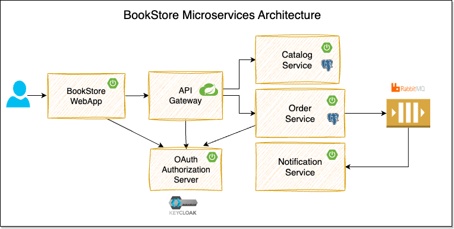
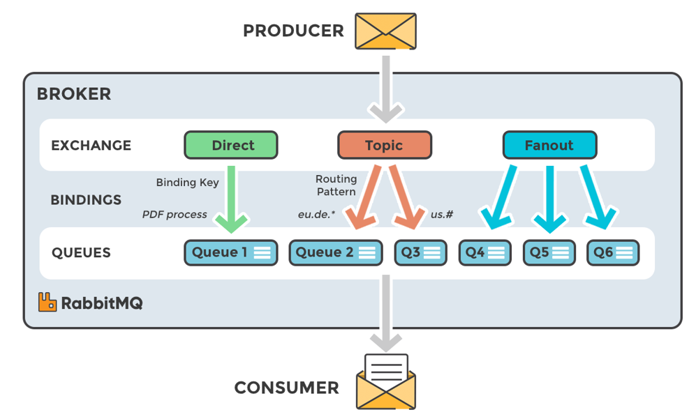

# BookStore Microservice Application



## What is Microservice Architecture?

Microservices is an architecture style where large applications are composed of small services that provide specific business capabilities that can be deployed and managed independently.

### Pros of Microservices

- Easy to scale individual services as per requirement
- Easy to adopt newer technologies if needed
- Smaller codebases easy to understand & maintain
- Easier to migrate code of a service from one language to another
- Less dependency on other team deliverables

### Cons of Microservices

- Difficult to build & manage distributed systems
- Difficult to test & debug
- Complex deployment process
- Performance issues (e.g., high latency can cause slower response time)

## Monolithic Architecture

Monolithic architecture is a type of application design where all components, including the user interface, business logic, and data access layers, are tightly integrated into a single, inseparable unit. This means the entire application is developed, deployed, and managed as a single package.

### Pros of Monolithic Architecture

- Simpler Development
- Easier Testing & Debugging
- Simpler Deployment

### Cons of Monolithic Architecture

- Difficult to scale sub-systems (modules)
- Difficult to adopt new technologies
- Higher chance to become "big ball of mud" – messy codebase & complex service communications

---

## Create Root Maven Project

1. Create a root Maven project with the following Maven coordinates:

    ```yml
    groupId: com.supersection
    artifactId: bookstore-microservice-application
    version: 0.0.1-SNAPSHOT
    type: pom
    ```

2. Create `.sdkmanrc` file with Java and Maven version configured

   ```yml
   java=21.0.7-tem
   maven=3.9.6
   ```

   This file allows SDKMAN to automatically switch to the specified versions when you enter the project directory.

### SDKMAN Command Reference

```bash
# List all available versions of Java
sdk list java

# Install a specific Java version
sdk install java 21.0.7-tem

# Install a specific Maven version
sdk install maven 3.9.6

# Apply the versions specified in .sdkmanrc
sdk env

# Automatically apply .sdkmanrc when changing directories (if enabled)
sdk env install
```

### Enable Auto-Environment Switching

To allow SDKMAN to automatically switch SDK versions based on the `.sdkmanrc` file:

1. View the current SDKMAN configuration:

   ```bash
   cat ~/.sdkman/etc/config
   ```

2. Modify the config by setting:

   ```ini
   sdkman_auto_env=true
   ```

   This enables SDKMAN to automatically detect and use the specified SDK versions whenever you cd into a directory containing a .sdkmanrc file.

#### Final Check

After making changes, restart your terminal and navigate to your project directory:

```bash
cd /path/to/your/project
```

You should see SDKMAN automatically switching to the configured Java and Maven versions.

### Setup Maven Wrapper (`mvnw`)

The Maven Wrapper is a small script and supporting files added to your project that ensure a specific Maven version is used — **without requiring it to be installed globally**.

Install Maven Wrapper using:

```bash
mvn wrapper:wrapper
```

---

## Catalog-service 

Create a new Spring Boot microservice with the name “catalog-service” and add the following features:

- Add dependencies:
   - Web
   - Validation
   - Spring Data JPA
   - Flyway
   - PostgreSQL
   - Actuator
   - Prometheus
   - DevTools
   - Configuration Processor
   - Testcontainers

- Add springdoc-openapi dependency
- Add rest-assured dependency
- Add git-commit-id-maven-plugin
- Add spotless-maven-plugin
- Create docker-compose file for PostgreSQL
- Add GitHub Action workflow

---

## Application Monitoring with Spring Boot Actuator

Spring Boot Actuator provides production-ready features to monitor and manage applications. It exposes a wide range of endpoints (like `/actuator/health`, `/actuator/info`, `/actuator/metrics`) which help in observing system health, build data, and runtime environment.

### Actuator Setup

1. Dependency (Spring Boot Starter):

    ```xml
    <dependency>
      <groupId>org.springframework.boot</groupId>
      <artifactId>spring-boot-starter-actuator</artifactId>
    </dependency>
    ```

2. Set catalog-service server port on `8081`
3. Access Actuator endpoints in browser: <http://localhost:8081/actuator>
4. Expose all actuator endpoints (Add the following in `application.properties`):

    ```properties
    management.endpoints.web.exposure.include=*
    ```

### Show Build Info

`pom.xml` build Configuration:

```xml
<plugin>
  <groupId>org.springframework.boot</groupId>
  <artifactId>spring-boot-maven-plugin</artifactId>
  <executions>
    <execution>
      <goals>
        <goal>build-info</goal>
      </goals>
    </execution>
  </executions>
</plugin>
```

This will add build metadata like version, group, and timestamp, which also appears in `/actuator/info`.

### Show Git Commit Info in `/actuator/info`

The `git-commit-id-maven-plugin` extracts Git metadata and generates `git.properties` under `target/classes`.

1. Plugin Setup in `pom.xml`:

    ```xml
    <plugin>
      <groupId>io.github.git-commit-id</groupId>
      <artifactId>git-commit-id-maven-plugin</artifactId>
      <executions>
        <execution>
          <goals>
            <goal>revision</goal>
          </goals>
        </execution>
      </executions>
      <configuration>
        <failOnNoGitDirectory>false</failOnNoGitDirectory>
        <failOnUnableToExtractRepoInfo>false</failOnUnableToExtractRepoInfo>
        <generateGitPropertiesFile>true</generateGitPropertiesFile>
        <includeOnlyProperties>
          <includeOnlyProperty>^git.branch$</includeOnlyProperty>
          <includeOnlyProperty>^git.commit.id.abbrev$</includeOnlyProperty>
          <includeOnlyProperty>^git.commit.user.name$</includeOnlyProperty>
          <includeOnlyProperty>^git.commit.message.full$</includeOnlyProperty>
        </includeOnlyProperties>
      </configuration>
    </plugin>
   ```

2. Once configured, build the app:

    ```bash
    mvn clean package
    ```

3. Enable full Git metadata display in `/actuator/info`

    ```properties
    management.info.git.mode=full
    ```

Access Git metadata at: <http://localhost:8081/actuator/info>

---

## Setup Swagger API Documentation

For the integration between spring-boot and swagger-ui, add the dependency in your `pom.xml`:

```xml
<dependency>
    <groupId>org.springdoc</groupId>
    <artifactId>springdoc-openapi-starter-webmvc-ui</artifactId>
    <version>2.8.8</version>
</dependency>
```

- The Swagger UI page will then be available at `http://server:port/context-path/swagger-ui.html`
- The OpenAPI description will be available in json format at: `http://server:port/context-path/v3/api-docs`

Refer to the Official [springdoc-openapi]((https://springdoc.org/)) page

---

## Integration Testing with Rest-Assured

[Rest-Assured](https://github.com/rest-assured/rest-assured) is a Java DSL for testing RESTful APIs. It simplifies writing expressive and maintainable API tests with fluent syntax.

Add the following dependency to your `pom.xml`:

```xml
<dependency>
      <groupId>io.rest-assured</groupId>
      <artifactId>rest-assured</artifactId>
      <version>5.5.5</version>
      <scope>test</scope>
</dependency>
```

Notes:

1. You should place rest-assured before the JUnit dependency declaration in your `pom.xml` / `build.gradle` in order to make sure that the correct version of Hamcrest is used. 
2. REST Assured includes JsonPath and XmlPath as transitive dependencies

---

## Java Code Formatter

Add the following plugin to your `pom.xml` (in each service):

```xml
<plugin>
    <groupId>com.diffplug.spotless</groupId>
    <artifactId>spotless-maven-plugin</artifactId>
    <version>2.44.5</version>
    <configuration>
        <java>
            <importOrder />
            <removeUnusedImports />
            <palantirJavaFormat>
                <version>2.35.0</version>
            </palantirJavaFormat>
            <formatAnnotations />
        </java>
    </configuration>
    <executions>
        <execution>
            <phase>compile</phase>
            <goals>
                <goal>check</goal>
            </goals>
        </execution>
    </executions>
</plugin>
```

Run the following command to apply consistent code formatting:

```bash
./mvnw spotless:apply
```

> **NOTE**: To run the command from the Root project directory, you need to add the same plugin in the root `pom.xml` build config.

---

## Docker Compose Setup

### Infrastructure & Dev Tools (`infra.yml`)

We are defining all supporting services & dev tools under the `deployment/docker-compose/infra.yml` file. They are needed to run or test the application locally. It includes:

- `catalog-db` → PostgreSQL image: `postgres:17-alpine3.21` (primary RDBMS)

Spin up the services under this file:

```bash
docker compose -f ./deployment/docker-compose/infra.yml up -d
```

---

## GitHub Actions CI Setup

This project uses GitHub Actions for automated Continuous Integration.

- Runs on every push and pull request
- Setup Java 21 with Maven caching
- Lints code and checks formatting
- Build the project with Maven

CI configuration for each service is defined under `.github/workflows/`.

> This ensures every change is validated early and consistently across environments.

---

## Taskfile Setup

1. Refer to the [Official Page](https://taskfile.dev/installation/) for installing task locally on your machine.

2. Check if task is installed correctly:

    ```bash
    task --version
    ```

3. Define the `Taskfile.yml` in the root project directory.
4. Afterward you can simply run specific `task` command to handle various project related commands in a consistent way.

### Example usage of `task` command

- To build projects while keeping the code properly formatted beforehand:
    
    ```bash
    task
    ```

- To start infrastructure service containers (`infra.yml`)

    ```bash
    task start_infra
    ```

---

## Dockerizing Services

The maven-plugin (build tools) can create an **OCI image** from a jar or war file using **Cloud Native Buildpacks** (CNB). Images can be built on the command-line using the `build-image` goal.

Refer to the Official [Spring Boot Docs for Building Images](https://docs.spring.io/spring-boot/maven-plugin/build-image.html).

### 1. Configure `spring-boot-maven-plugin` to create docker image
    
- Add a property in `pom.xml`:

    ```xml
    <dockerImageName>supersection/bookstore-${project.artifactId}</dockerImageName>
    ```

- Add configuration under `spring-boot-maven-plugin` in the build section of `pom.xml`:

    ```xml
    <plugin>
        <groupId>org.springframework.boot</groupId>
        <artifactId>spring-boot-maven-plugin</artifactId>
        <configuration>
            <image>
                <name>${dockerImageName}</name>
                <!-- <builder>dashaun/builder:tiny</builder>  ## Include this if you're on Mac or need to support arm64 docker image -->
            </image>
        </configuration>
        <executions>
            <execution>
                <goals>
                    <goal>build-info</goal>
                </goals>
            </execution>
        </executions>
    </plugin>
    ```

- Run the following to build the docker image
    
    ```bash
    # From root directory
    ./mvnw -pl catalog-service spring-boot:build-image -DskipTests
    ```

### 2. Create DockerHub Access Token

- Login into your [DockerHub](https://hub.docker.com/explore) account
- Go to your `Account settings > Personal access tokens > Generate new token`
- Copy the access token

### 3. Configure GitHub Actions Secrets

Configure DockerHub Credentials as Secrets in GitHub Repository:

- Go to your project repository `Settings > Secrets and variables > Actions`
- Create the following repository secrets:
  - `DOCKERHUB_USERNAME`
  - `DOCKERHUB_TOKEN`

### 4. Setup CI pipeline to Build & Push Image to DockerHub

Update GitHub Actions to build docker image and push it to DockerHub:

- Add action to Login into Docker Hub:

    ```yml
    - if: ${{ github.ref == 'refs/heads/main' }}
      name: Login to Docker Hub
      uses: docker/login-action@v3
      with:
        username: ${{ secrets.DOCKERHUB_USERNAME }}
        password: ${{ secrets.DOCKERHUB_TOKEN }}
    ```

- Set Docker Image Name as an environment variable:

    ```yml
    env:
      DOCKER_IMAGE_NAME: ${{ secrets.DOCKERHUB_USERNAME }}/bookstore-catalog-service
    ```

- Add action to build the image and push it to your Docker Hub account:

    ```yml
    - if: ${{ github.ref == 'refs/heads/main' }}
      name: Build and Publish Docker Image
      run: |
        ./mvnw spring-boot:build-image -DskipTests
        echo "Pushing the image $DOCKER_IMAGE_NAME to Docker Hub..."
        docker push $DOCKER_IMAGE_NAME
    ```

---

## RabbitMQ Messaging Patterns



### Exchange Types

1. **Direct Exchange:** Messages are being routed based on routing keys. This means that when the routing key matches the binding key, the message gets delivered to its corresponding queue.
<br> _Example:_ `orders`, `cancellations`, `accounts`, `new-order`, `delivered-orders` etc.

2. **Topic Exchange:** Routing happens based on patterns and wildcards.
<br> _Example:_ `orders.new.*`, `orders.*.cancelled`, `order.new.#` etc

3. **Fanout Exchange:** Binding key is ignored, RabbitMQ broadcasts the messages to all the queues that are bound to it regardless of the routing key.

> **NOTE:** If there are multiple consumers connected to a single queue, RabbitMQ uses a round-robin dispatching method to distribute messages among them. That means, each message is only delivered to one consumer at a time.

We are going to utilize simple Direct Exchange as per our use case.

---

## `TestDataFactory` class in Order Service

- Generates test data for unit/integration tests — specifically `CreateOrderRequest` objects with valid and invalid data.
- Keeps tests clean, reusable, and focused on behavior, not data creation.
- Uses [Instancio](https://www.instancio.org/) library to auto-generate complex nested objects.

### Add Instancio dependency to pom.xml

```xml
<dependency>
  <groupId>org.instancio</groupId>
  <artifactId>instancio-core</artifactId>
  <version>3.4.0</version>
  <scope>test</scope>
</dependency>
```

---

## Service-to-Service calls using RestClient

Refer to the Official Spring Boot documentation for [REST Clients Integration](https://docs.spring.io/spring-framework/reference/integration/rest-clients.html)

We are going to use `RestClient` for calling catalog-service from order-service.

1. Add the catalog-service base URL in the `application.properties` of order-service:
    
   ```properties
    orders.catalog-service-url=http://localhost:8081
    ```

2. Setup `RestClient` bean with a base URL from `ApplicationProperties` to enable HTTP calls to the Catalog Service.
3. Use `RestClient` to fetch product details by product code from the `/api/products/{code}` endpoint.

---

## Resilience Patterns

Resilience patterns are crucial for building robust and fault-tolerant applications, especially in microservices architectures. These patterns help applications handle failures gracefully and prevent cascading failures across services.

- **Timeout:** This pattern sets a maximum time for a request to complete, preventing the application from waiting indefinitely for a slow or unresponsive service.
- **Retry:** Allows an application to automatically retry a failed request after a short delay, which can be useful for handling transient failures.
- **Circuit Breaker:** Prevents an application from repeatedly trying to access a failing service. It "opens" the circuit when a service fails, stopping requests for a period, and then "closes" it again when the service recovers.
- **Bulkhead:** Isolates different parts of an application to prevent a failure in one part from affecting others. It limits concurrent access to resources.
- **Rate Limiter:** Limits the number of requests an application can make to a service within a given period, preventing overload.
- **Fallback:** This pattern defines an alternative action to take when a request fails, such as returning a default value or displaying an error message.

> [Resilience4j](https://resilience4j.readme.io/) is a fault tolerance library for Java

### Add the following [Resilience4j SpringBoot3 dependency](https://mvnrepository.com/artifact/io.github.resilience4j/resilience4j-spring-boot3)

```xml
<dependency>
    <groupId>io.github.resilience4j</groupId>
    <artifactId>resilience4j-spring-boot3</artifactId>
    <version>2.3.0</version>
</dependency>
```

---

## [WireMock](https://wiremock.org/) to mock External API calls for Testing

- Refer to Official GitHub page of [WireMock module for Testcontainers for Java](https://github.com/wiremock/wiremock-testcontainers-java)
- [Testcontainers](https://testcontainers.com/) > Guides > [Testing REST API integrations using WireMock](https://testcontainers.com/guides/testing-rest-api-integrations-using-wiremock/)

### Add the following WireMock dependencies

```xml
<dependency>
    <groupId>org.wiremock</groupId>
    <artifactId>wiremock-standalone</artifactId>
    <version>${wiremock.version}</version>
    <scope>test</scope>
</dependency>
<dependency>
    <groupId>org.wiremock.integrations.testcontainers</groupId>
    <artifactId>wiremock-testcontainers-module</artifactId>
    <version>${wiremock-testcontainers.version}</version>
    <scope>test</scope>
</dependency>
```

- Use `WireMockContainer` to mock the catalog-service integration for testing
- Overwrite the `orders.catalog-service-url` to take `wiremockServer`'s `baseUrl`
- `mockGetProductByCode` method will be used to mock the behaviour of API calling to catalog-service

---

### Author

- [Soumo Sarkar](https://www.linkedin.com/in/soumo-sarkar/)

### Local Development Setup

- Install Java 21. Recommended using [SDKMAN](https://sdkman.io/) for Installing JDK
- Choose your preferred IDE: [IntelliJ IDEA](https://www.jetbrains.com/idea/), [VS Code](https://code.visualstudio.com/)
- Install [Docker Desktop](https://www.docker.com/products/docker-desktop/)
- [Postman](https://www.postman.com/downloads/) or any REST API Client

### Reference

- [Spring Boot Microservices Complete Tutorial](https://youtu.be/ZKQWwCUEABY?si=W-kK8n5_AP7O-Sei)
